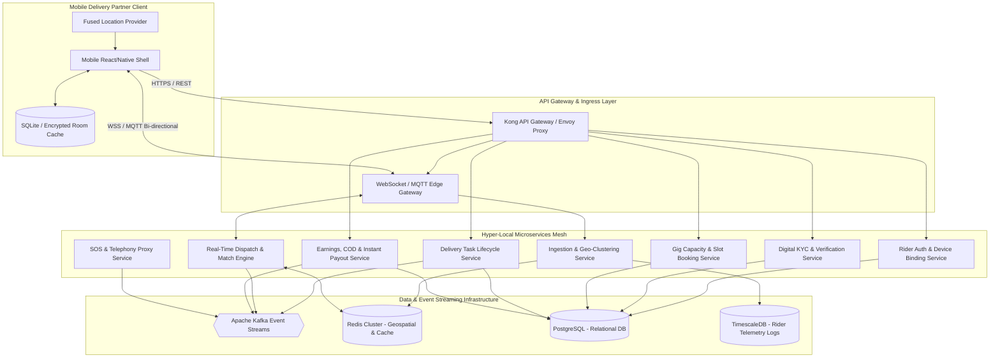
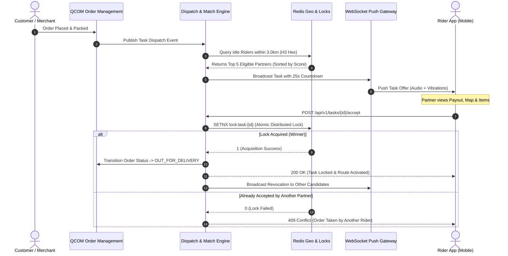
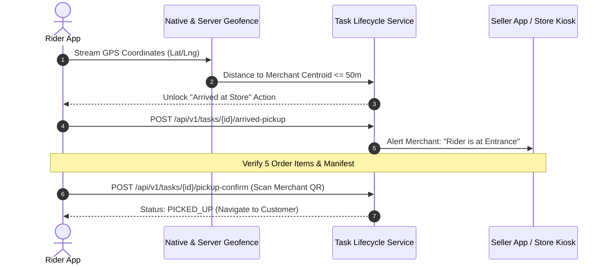

# QCOM Delivery Partner Platform - System Architecture Blueprint & Data Flow Specification

**Architecture Version:** 2.0.0  
**Target Scale:** 50,000 Concurrent Delivery Partners | 250,000 Orders/Day | Sub-15s Dispatch Latency  
**Infrastructure Target:** Cloud-Native Kubernetes (EKS/GKE), Kafka Event Bus, Redis Geospatial Clusters, TimescaleDB & PostgreSQL  

---

## 1. High-Level Distributed System Architecture



---

## 2. Microservice Topology & Boundaries

| Service Name | Responsibility | Tech Stack | Storage / Data Stores |
| :--- | :--- | :--- | :--- |
| **Rider Ingress & Auth Service** | JWT session issuance, device fingerprinting, hardware binding, root check validation | Go / Node.js | PostgreSQL, Redis (Token Revocation List) |
| **Digital KYC & BGV Service** | OCR extraction, Digilocker OAuth, Parivahan API, Penny-drop validation, BGV webhook processing | Python / FastAPI | PostgreSQL, S3/GCS (Encrypted Document Bucket) |
| **Geo-Location & Tracking Service** | Ingesting GPS telemetry (pings every 3s), map-matching, road-snapping, H3 cell binning | Go (High Concurrency) | Redis (`GEOADD`), TimescaleDB (Audit Trail) |
| **Dispatch & Order Match Engine** | Calculating candidate riders, score evaluation (distance, rating, battery, vehicle type), broadcast fan-out | Go / Rust | Redis (Live State), Kafka (`dispatch.events`) |
| **Gig Booking & Capacity Service** | Hourly demand forecasting, shift creation, tiered slot releases, no-show monitoring | Java / Spring Boot | PostgreSQL, Redis Distributed Locks (`Redlock`) |
| **Delivery Task Lifecycle Service** | State machine management, OTP validation, geofence validation, merchant prep alerts | Node.js / TypeScript | PostgreSQL, Kafka (`orders.lifecycle`) |
| **Earnings & Float Cash Service** | Payout formula evaluation, COD floating cash limits, incentive progress, UPI instant payout | Go / Node.js | PostgreSQL, Redis (Atomic Balance Locks) |
| **Safety, Voice & SOS Service** | In-app IVR call bridging (Twilio/Exotel), 1-tap SOS trigger, real-time emergency dispatch routing | Node.js | PostgreSQL, Webhook queues |

---

## 3. Database Entity Schemas (PostgreSQL / Relational Data Model)

### 3.1 `delivery_partners` (Partner Profile & Device Hardware Binding)
```sql
CREATE TABLE delivery_partners (
    id UUID PRIMARY KEY DEFAULT gen_random_uuid(),
    partner_code VARCHAR(32) UNIQUE NOT NULL,
    full_name VARCHAR(128) NOT NULL,
    phone_number VARCHAR(16) UNIQUE NOT NULL,
    email VARCHAR(128) UNIQUE NOT NULL,
    vehicle_type VARCHAR(24) NOT NULL CHECK (vehicle_type IN ('BICYCLE', 'EV_2W', 'ICE_2W', 'AUTO_4W')),
    vehicle_registration_number VARCHAR(32),
    kyc_status VARCHAR(24) NOT NULL DEFAULT 'PENDING' CHECK (kyc_status IN ('PENDING', 'DOCS_UPLOADED', 'BGV_PROCESSING', 'APPROVED', 'REJECTED')),
    tier_level VARCHAR(16) NOT NULL DEFAULT 'BRONZE' CHECK (tier_level IN ('BRONZE', 'SILVER', 'GOLD', 'PLATINUM')),
    is_online BOOLEAN NOT NULL DEFAULT FALSE,
    is_active_duty BOOLEAN NOT NULL DEFAULT FALSE,
    current_h3_index VARCHAR(16),
    hardware_device_id VARCHAR(128) NOT NULL,
    floating_cash_balance NUMERIC(10, 2) NOT NULL DEFAULT 0.00,
    floating_cash_limit NUMERIC(10, 2) NOT NULL DEFAULT 2500.00,
    rating_avg NUMERIC(3, 2) NOT NULL DEFAULT 5.00,
    total_trips_completed INT NOT NULL DEFAULT 0,
    created_at TIMESTAMPTZ NOT NULL DEFAULT NOW(),
    updated_at TIMESTAMPTZ NOT NULL DEFAULT NOW()
);

CREATE INDEX idx_partners_h3 ON delivery_partners(current_h3_index) WHERE is_online = TRUE;
CREATE INDEX idx_partners_hardware ON delivery_partners(hardware_device_id);
```

### 3.2 `shift_slots` (Gig Booking & Fleet Capacity)
```sql
CREATE TABLE shift_slots (
    id UUID PRIMARY KEY DEFAULT gen_random_uuid(),
    hub_id VARCHAR(64) NOT NULL,
    zone_name VARCHAR(128) NOT NULL,
    shift_type VARCHAR(32) NOT NULL CHECK (shift_type IN ('MORNING_PEAK', 'MIDDAY_PEAK', 'AFTERNOON_SLOT', 'EVENING_PEAK')),
    start_time TIMESTAMPTZ NOT NULL,
    end_time TIMESTAMPTZ NOT NULL,
    capacity_limit INT NOT NULL,
    booked_count INT NOT NULL DEFAULT 0,
    min_earnings_guarantee NUMERIC(10, 2) NOT NULL,
    tier_access_schedule JSONB NOT NULL, -- {"PLATINUM": "-72h", "GOLD": "-48h", "SILVER": "-24h"}
    status VARCHAR(24) NOT NULL DEFAULT 'OPEN' CHECK (status IN ('OPEN', 'FILLED', 'LOCKED', 'EXPIRED')),
    created_at TIMESTAMPTZ NOT NULL DEFAULT NOW()
);

CREATE TABLE shift_bookings (
    id UUID PRIMARY KEY DEFAULT gen_random_uuid(),
    shift_slot_id UUID NOT NULL REFERENCES shift_slots(id) ON DELETE CASCADE,
    partner_id UUID NOT NULL REFERENCES delivery_partners(id),
    status VARCHAR(24) NOT NULL DEFAULT 'CONFIRMED' CHECK (status IN ('CONFIRMED', 'CHECKED_IN', 'NO_SHOW', 'COMPLETED', 'CANCELLED')),
    check_in_time TIMESTAMPTZ,
    auto_released_at TIMESTAMPTZ,
    created_at TIMESTAMPTZ NOT NULL DEFAULT NOW(),
    UNIQUE(shift_slot_id, partner_id)
);
```

### 3.3 `delivery_tasks` (Order Lifecycle State Machine)
```sql
CREATE TABLE delivery_tasks (
    id UUID PRIMARY KEY DEFAULT gen_random_uuid(),
    order_id VARCHAR(64) NOT NULL UNIQUE,
    order_number VARCHAR(32) NOT NULL UNIQUE,
    assigned_partner_id UUID REFERENCES delivery_partners(id),
    status VARCHAR(32) NOT NULL DEFAULT 'BROADCASTING' CHECK (
        status IN ('BROADCASTING', 'ASSIGNED', 'ARRIVED_PICKUP', 'PICKED_UP', 'ARRIVED_DROP', 'DELIVERED', 'FAILED', 'RETURNED')
    ),
    is_batched BOOLEAN NOT NULL DEFAULT FALSE,
    batch_parent_task_id UUID REFERENCES delivery_tasks(id),
    pickup_hub_id VARCHAR(64) NOT NULL,
    pickup_latitude NUMERIC(10, 7) NOT NULL,
    pickup_longitude NUMERIC(10, 7) NOT NULL,
    drop_latitude NUMERIC(10, 7) NOT NULL,
    drop_longitude NUMERIC(10, 7) NOT NULL,
    total_distance_km NUMERIC(6, 2) NOT NULL,
    estimated_duration_minutes INT NOT NULL,
    order_items_count INT NOT NULL,
    order_total_weight_kg NUMERIC(6, 2) NOT NULL,
    payment_mode VARCHAR(16) NOT NULL CHECK (payment_mode IN ('PREPAID', 'COD')),
    cod_amount_due NUMERIC(10, 2) NOT NULL DEFAULT 0.00,
    cod_amount_collected NUMERIC(10, 2) DEFAULT 0.00,
    delivery_otp_hash VARCHAR(128) NOT NULL,
    proof_of_delivery_image_url TEXT,
    base_fare NUMERIC(10, 2) NOT NULL,
    distance_fare NUMERIC(10, 2) NOT NULL,
    wait_time_pay NUMERIC(10, 2) NOT NULL DEFAULT 0.00,
    surge_multiplier NUMERIC(3, 2) NOT NULL DEFAULT 1.00,
    customer_tip NUMERIC(10, 2) NOT NULL DEFAULT 0.00,
    total_partner_payout NUMERIC(10, 2) NOT NULL,
    arrived_merchant_at TIMESTAMPTZ,
    picked_up_at TIMESTAMPTZ,
    delivered_at TIMESTAMPTZ,
    created_at TIMESTAMPTZ NOT NULL DEFAULT NOW()
);

CREATE INDEX idx_delivery_tasks_partner ON delivery_tasks(assigned_partner_id);
CREATE INDEX idx_delivery_tasks_status ON delivery_tasks(status);
```

### 3.4 `partner_ledger_entries` (Financial Ledger & Payouts)
```sql
CREATE TABLE partner_ledger_entries (
    id UUID PRIMARY KEY DEFAULT gen_random_uuid(),
    partner_id UUID NOT NULL REFERENCES delivery_partners(id),
    task_id UUID REFERENCES delivery_tasks(id),
    transaction_type VARCHAR(32) NOT NULL CHECK (
        transaction_type IN ('DELIVERY_PAYOUT', 'SURGE_BONUS', 'WAIT_TIME_COMPENSATION', 'MILESTONE_INCENTIVE', 'COD_CASH_COLLECTED', 'COD_DEPOSIT', 'INSTANT_PAYOUT_WITHDRAWAL', 'TDS_TAX_DEDUCTION')
    ),
    entry_category VARCHAR(8) NOT NULL CHECK (entry_category IN ('CREDIT', 'DEBIT')),
    amount NUMERIC(10, 2) NOT NULL,
    running_balance NUMERIC(10, 2) NOT NULL,
    external_payout_reference VARCHAR(64),
    status VARCHAR(16) NOT NULL DEFAULT 'COMPLETED' CHECK (status IN ('PENDING', 'COMPLETED', 'FAILED')),
    created_at TIMESTAMPTZ NOT NULL DEFAULT NOW()
);

CREATE INDEX idx_ledger_partner_time ON partner_ledger_entries(partner_id, created_at DESC);
```

---

## 4. End-to-End Data Flows & Event Sequences

### 4.1 Order Broadcast, Competitive Lock & Dispatch Flow


### 4.2 Merchant Arrival, Verification & Handover Flow


---

## 5. REST & WebSocket API Contracts

### 5.1 Telemetry Streaming (WebSocket / MQTT)
- **Topic / Channel:** `rider/{partner_id}/telemetry`
- **Direction:** Client $\rightarrow$ Server
- **Payload Schema:**
```json
{
  "partnerId": "usr_99214ab",
  "timestamp": 1774247000123,
  "latitude": 12.9352422,
  "longitude": 77.6244621,
  "heading": 142.5,
  "speedMps": 6.8,
  "accuracyMeters": 4.2,
  "batteryPercent": 84,
  "isCharging": false,
  "activeTaskId": "task_8832104"
}
```

### 5.2 Duty Toggle & Safety Interlock Endpoint
- **Endpoint:** `POST /api/v1/partner/duty-status`
- **Request:**
```json
{
  "isOnline": true,
  "batteryLevel": 84,
  "locationPermissionGranted": true,
  "deviceInfo": {
    "hardwareId": "9b12e34-f89a-4c22",
    "isRooted": false,
    "isMockLocation": false
  }
}
```
- **Response (Success - 200 OK):**
```json
{
  "success": true,
  "status": "ONLINE",
  "assignedHub": {
    "hubId": "hub_koramangala_04",
    "name": "Koramangala 4th Block Fulfillment Hub",
    "coordinates": [12.9345, 77.6252]
  },
  "activeShift": {
    "shiftId": "shift_midday_9912",
    "startTime": "2026-09-22T11:00:00Z",
    "endTime": "2026-09-22T14:00:00Z",
    "guaranteedMinPayout": 450.00
  }
}
```

### 5.3 Order Completion & OTP Verification
- **Endpoint:** `POST /api/v1/tasks/{taskId}/verify-otp`
- **Request:**
```json
{
  "otp": "4921",
  "currentCoordinates": {
    "latitude": 12.938102,
    "longitude": 77.629410
  },
  "cashCollected": 0.00,
  "proofImageUrl": null
}
```
- **Response (200 OK):**
```json
{
  "success": true,
  "orderStatus": "DELIVERED",
  "creditedPayout": {
    "basePay": 35.00,
    "distancePay": 17.50,
    "surgeBonus": 15.00,
    "tips": 20.00,
    "totalCredited": 87.50
  },
  "walletSummary": {
    "todayTotalEarnings": 742.50,
    "withdrawableBalance": 742.50,
    "completedDeliveriesToday": 8
  }
}
```

---

## 6. Edge Cases, Failure Modes & Resilience Architecture

| Edge Case / Scenario | Root Cause | System Mitigation Strategy |
| :--- | :--- | :--- |
| **Simultaneous Task Acceptance** | Multiple nearby riders tap "Accept" on the broadcast within the same millisecond. | Atomic Redis distributed lock (`SETNX lock:task:{id} rider_uuid PX 30000`). Only the first response gets key ownership; subsequent requests fail with `409 Conflict` and UI gently reverts to broadcast listening. |
| **Network Dead Zone at Delivery Doorstep** | High-rise basement or concrete stairwell drops cellular signal to zero. | Client-side optimistic verification: OTP hash verified against locally cached salt, proof photo stored in encrypted Room DB, and delivery timestamp logged locally. Background job synchronizes payload immediately upon signal restoration. |
| **GPS Telemetry Jumps & Spoofing** | Mock GPS apps, Android mock provider injection, or multipath urban canyon reflection. | Server-side Kalman filter velocity check. If distance divided by time elapsed implies speed $>110\text{ km/h}$ for a two-wheeler, location ping is discarded and partner flagged for review. Mock GPS flag automatically checked via native Android API. |
| **Merchant Prep Delays (>15 mins)** | Kitchen / seller store bottleneck causes rider to wait outside. | Automatic timer starts at arrival geofence ping. At 5 minutes wait time, system auto-credits ₹1.20/min wait-time allowance to rider, alerts store picker lead, and updates customer ETA seamlessly. |
| **Customer Doorstep No-Show** | Customer not answering doorbell or phone calls. | Partner initiates in-app "Customer Unreachable" countdown (5:00 minutes). System triggers 3 automated IVR calls to customer. At 0:00, return trip order automatically created, rider credited full fare + return fee. |
| **Low Battery Mid-Transit** | Partner device drops below 5% battery during active delivery. | System preserves order state on backend. Nearby backup rider can be assigned via ops portal if phone disconnects for $>10$ minutes, triggering an automatic safety alert. |

