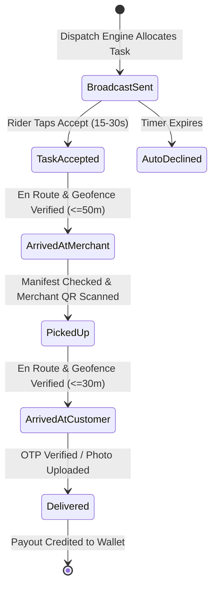

# QCOM Delivery Partner App - Master Product Requirements Document (PRD)

**Document Version:** 2.0.0  
**Status:** Approved & Production-Targeted  
**Author:** Senior Principal Product Manager & System Architect (Hyper-Local Logistics)  
**Target Platform:** Mobile-First (Android / iOS via Native Shell & PWA) + Responsive Desktop Web Console  

---

## 1. Executive Summary & Product Vision
The **QCOM Delivery Partner App** is the fourth core pillar in the QCOM Quick-Commerce ecosystem (alongside Customer App, Seller App, and Admin Portal). Operating in hyper-dense urban clusters with SLA delivery windows of **10 to 20 minutes**, the platform requires sub-second dispatch coordination, high-precision geo-telemetry, strict safety controls, and transparent earnings distribution.

The application serves as the sole operational cockpit for delivery partners (independent gig riders, EV fleet operators, and bicycle couriers), translating algorithmic dispatch instructions into clear, safe, low-cognitive-load physical actions.

---

## 2. Personas & Ergonomic Constraints
1. **Full-Time Gig Partner (Two-Wheeler / EV)**: Operates across operating slots (08:00 AM – 08:00 PM). Requires high-contrast daylight readability, minimal typing, one-thumb tap targets (≥48px), and fast instant payout liquidity.
2. **Part-Time / Express Courier (Two-Wheeler / Bicycle)**: Operates during peak slots (Morning / Midday / Evening). Requires short-distance order clustering (≤2.5 km) and lighter parcel weight quotas (≤5 kg).
3. **Fleet / Hub Operations Manager**: Supervises rider presence, KYC clearance, floating cash reconciliation, and exceptions from a desktop interface.

### Ergonomic Design Tenets:
- **Outdoor Sun-Glitter Contrast**: Strict WCAG AA compliant text on warm neutral surfaces (`#f4f5f7` canvas with high-contrast `#121212` body text and `#f25100` primary action).
- **Gloves & Single-Hand Usability**: All critical actions (Accept, Arrived, Complete) placed in the lower ergonomic thumb zone.
- **Audio & Haptic Multi-Sensory Feedback**: High-decibel distinctive chimes with hardware haptics for order broadcasts, safety warnings, and OTP verification confirmations.

---

## 3. Detailed Module Specifications

### Module 1: Onboarding, Digital KYC & Asset Management
#### 1.1 Digital Identity & Document Verification
- **Aadhaar / National ID**: Verification via Digilocker OAuth2 or OCR capture + UIDAI OTP validation. Masked Aadhaar storage (storing only last 4 digits) with SHA-256 hash.
- **PAN Card Verification**: Real-time NSDL / Income Tax API query to match Name, Father's Name, and Date of Birth against identity records.
- **Driving License (DL)**: Parivahan Sarathi API validation. DL status check for expiry, commercial/non-commercial entitlement, and license class (`MCWG` for motorcycles with gear).
- **Vehicle Registration Certificate (RC)**: Vahan API verification ensuring valid fitness certificate, road tax validity, and fuel-type classification (EV vs ICE).
- **Bank Account / UPI VPA Validation**: Penny-drop verification (₹1 transfer via IMPS/RazorpayX) returning account holder's registered bank name for fuzzy string matching against KYC name.

#### 1.2 Automated Background Verification (BGV)
- API integration with external background check vendors (e.g., AuthBridge / IDfy).
- Automated scanning of national court records (eCourts database) and police criminal databases.
- Automated score assignment:
  - `GREEN`: Immediate approval to select orientation slots.
  - `AMBER`: Manual ops review required within 12 hours.
  - `RED`: Permanent rejection and hardware/phone blacklist.

#### 1.3 Vehicle Profile Engine & Constraint Matrix (Hardware & Automotive Parts)
| Vehicle Profile | Distance Constraint | Weight Limit | Ideal Order Archetype |
| :--- | :--- | :--- | :--- |
| **Bicycle** | ≤ 2.5 km radius | ≤ 5 kg | Small Fasteners, Relays, Modular Switches, Plumbing Tapes |
| **EV Scooter (Light)** | ≤ 6.0 km radius | ≤ 15 kg | Power Tools, Cable Coils, Bath/Kitchen Fittings, Two-Wheeler Spares |
| **Motorcycle / ICE** | ≤ 10.0 km radius | ≤ 25 kg | Car Brake Discs, Engine Oils (1-5L), Basin Mixers, Adhesives |
| **Electric Cargo 3W** | Unlimited hub-zone | ≤ 120 kg | Pipe Bundles, Heavy Inverter/Car Batteries, Submersible Pumps |

#### 1.4 Asset Management & Mandatory Safety Training
- **Asset Allocation Tracking**: Scanning QR code on physical assets (QCOM heavy-duty reinforced tool/spares delivery bag and high-visibility rain jacket) linking asset IDs directly to rider profile.
- **Micro-Learning Training Modules**: Interactive video carousel within app covering:
  - Jobsite interaction etiquette, workshop handovers, and contactless delivery.
  - Safe urban riding with heavy tool bags and helmet compliance.
  - Hardware handling, plumbing fittings care, and chemical/automotive fluids segregation.
  - Mandatory 5-question comprehension quiz before initial duty toggle unlock.

---

### Module 2: Duty Management, Zone Allocation & Shift/Gig Booking

#### 2.1 Online/Offline Duty Switch & Safety Interlocks
- **Low Battery Interlock**: If device battery drops below 15% and device is not connected to a charger, incoming broadcasts are suspended and partner is given a 10-minute warning before auto-going offline.
- **Location Permission Interlock**: If High-Accuracy GPS is disabled or background location permission is revoked, the toggle immediately flips to `Offline` with an actionable system settings prompt.
- **Mandatory Helmet Selfie Check**: Periodic AI facial recognition verification before duty start verifying partner is wearing an approved helmet.

#### 2.2 Gig/Shift Booking Engine & Tiered Access (Operating Hours: 08:00 AM – 08:00 PM)
- **4 Operating Shift Slots (3 Hours Each)**:
  - `Morning Contractor & Site Rush`: 08:00 AM – 11:00 AM (Minimum Guarantee ₹360, 1.25x Surge)
  - `Midday Workshop & Garage Peak`: 11:00 AM – 02:00 PM (Minimum Guarantee ₹450, 1.35x Surge)
  - `Afternoon Express Spares Run`: 02:00 PM – 05:00 PM (Minimum Guarantee ₹380, 1.20x Surge)
  - `Evening Maintenance & Repair Surge`: 05:00 PM – 08:00 PM (Minimum Guarantee ₹550, 1.50x Surge)
- **Predictive Capacity Engine**:
  $$\text{Required Partners}(h, z) = \frac{\text{Forecasted Orders}(h, z) \times \overline{\text{Trip Time}}}{\text{Target SLA Efficiency}} \times (1 + \text{Buffer Factor}_{\text{Weather, Traffic}})$$
- **Tiered Access Release Windows**:
  - `Platinum Partners (Rating ≥ 4.85, Completion ≥ 98%)`: Slot booking opens **72 hours** in advance.
  - `Gold Partners (Rating ≥ 4.70, Completion ≥ 95%)`: Slot booking opens **48 hours** in advance.
  - `Silver / Bronze Partners`: Slot booking opens **24 hours** in advance.
- **Spot Booking & Drop-In Capacity**: Real-time surge map allowing instant drop-in when zone demand exceeds scheduled capacity by >20%.
- **No-Show & Ghost Shift Policy**:
  - Partners must be within 1.0 km of designated zone geofence within 15 minutes of shift start.
  - At 15:01 minutes without check-in: Slot automatically revoked and broadcast to standby pool.
  - Strike penalty added: 3 strikes within 30 days results in 7-day slot booking suspension.

#### 2.3 Geofencing, Stray Alerts & Heatmaps
- Real-time H3 hexagonal spatial indexing (Resolution 8 / ~460m hexes).
- Color-coded demand layers:
  - `Subtle Grey`: Normal demand ($1.0\times$ base pay).
  - `Muted Amber`: Moderate demand ($1.2\times$ surge).
  - `Refined Coral/Red`: High surge ($1.5\times - 2.0\times$ surge bonus).
- **Stray Alert Warning**: If partner strays >3 km outside active assigned cluster while idle, a push notification triggers: *"Return to Koramangala Hub to receive high-frequency orders"*.

---

### Module 3: Order Lifecycle & Dispatch Execution Engine

#### 3.1 State Machine & Canonical Status Mapping

#### 3.2 Broadcast & Acceptance Specifications
- **Display Card**: Order Number, Guaranteed Payout (₹), Estimated Distance (km), Pickup Store Name & Neighborhood, Drop Landmark, and Item Count.
- **Timeout**: 25-second countdown circular timer with escalating audio cadence.
- **Order Batching (Multi-Order Pooling)**:
  - Allowed only if Pickups are within the same merchant hub or <500m apart.
  - Destination drop coordinates must have an angular deviation of <30° along the main travel route.
  - Maximum 2 active orders per two-wheeler courier to preserve the 15-minute delivery SLA.

#### 3.3 Merchant Pickup Phase
- In-app turn-by-turn guidance with 2-wheeler optimized routing.
- **Geofence Check**: "Arrived at Store" button enabled only when device GPS is within 50 meters of store centroid.
- **Item Level Manifest**: Visual checklist with item counts and temperature sensitivity tags (e.g. `ICE PACK REQUIRED`).
- **"Order Not Ready" Delay Reporting**:
  - Rider can trigger delay report if merchant has not packed order within 3 minutes of arrival.
  - Merchant prep delay automatically extends customer ETA and credits rider with wait-time compensation (₹1.20/min after 5 minutes).

#### 3.4 Customer Delivery Phase
- Gated community instructions, tower number, flat/unit, and entry intercom codes.
- **Proof of Delivery (POD) Matrix**:
  - `Standard Delivery`: 4-digit customer PIN entered by rider and verified against server hash.
  - `Contactless Delivery (Doorstep Drop)`: Compulsory high-resolution camera photo capturing parcel at customer doorstep with embedded timestamp and GPS watermark.
  - `Cash on Delivery (COD)`: Exact cash collection workflow with live change calculator.

---

### Module 4: Earnings, Cash Management & Payout Infrastructure

#### 4.1 Dynamic Payout Formula
$$\text{Total Payout} = \text{Base Fare} + \text{Distance Fare} + \text{Wait Time Pay} + \text{Surge Multiplier} + \text{Customer Tip}$$
Where:
- $\text{Base Fare} = ₹35.00$ (covers initial $0.0 - 2.0\text{ km}$)
- $\text{Distance Fare} = ₹8.50 \times \max(0, \text{Total Distance} - 2.0)$
- $\text{Wait Time Pay} = ₹1.20 \times \max(0, \text{Store Wait Minutes} - 5)$
- $\text{Surge Multiplier} = \text{Dynamic Cluster Surge (e.g., } 1.25\times \text{ during heavy rain)}$
- $\text{Customer Tip} = 100\% \text{ direct pass-through with zero platform deduction}$

#### 4.2 Floating Cash & COD Reconciliation Engine
- **Floating Cash Threshold**: Maximum limit of **₹2,500** accumulated cash-on-delivery balance.
- **Threshold Triggers**:
  - `At ₹2,000`: Advisory notification encouraging UPI self-deposit.
  - `At ₹2,500`: System block disabling incoming COD orders until cash is remitted via instant virtual account UPI collection or hub kiosk cash drop.
  - `At ₹3,000`: Complete duty toggle block until reconciliation.

#### 4.3 Incentives & Instant Payouts
- **Milestone Ladder**:
  - Complete 12 trips today $\rightarrow +₹180$ bonus.
  - Complete 20 trips today $\rightarrow +₹350$ bonus.
  - Complete 85 trips this week $\rightarrow +₹1,500$ weekly power rider bonus.
- **Instant UPI Liquidity**: Direct integration with banking settlement APIs (RazorpayX / Cashfree Instant Payouts) enabling 24/7/365 IMPS/UPI transfers with 0% fee on daily earnings up to ₹5,000.

---

### Module 5: Safety, Communication & Dispute Handling

#### 5.1 Telephony Proxy & Number Masking
- Partner never sees customer's real MSISDN and customer never sees partner's private number.
- In-app call button invokes backend IVR bridge (Exotel / Twilio) dialing both legs simultaneously with call duration and recording logs stored for dispute audits.

#### 5.2 Emergency SOS & Incident Response
- Dedicated hardware-accessible SOS widget.
- Long-press (3 seconds) triggers:
  1. Live real-time GPS stream published to Emergency Ops Command Center at 1-second intervals.
  2. Automated outbound phone dialer to regional emergency services (112) and QCOM 24/7 Rapid Incident Response Team.
  3. Silent SMS dispatch to partner's registered emergency contacts with map tracking link.

#### 5.3 Exception Handling & "Unreachable Customer" Protocol
1. Partner arrives at customer coordinates.
2. If customer does not answer door or calls: Partner initiates **"Customer Unreachable"** flow.
3. Automated 5-minute countdown starts; backend triggers 3 automated IVR calls and push notifications to customer.
4. If timer expires without answer: Task transitions to `return_to_hub` or `dispose_authorized`, and partner receives full trip fare + ₹25 return trip compensation.

---

### Module 6: Performance Scorecards & Gamification

#### 6.1 Key Performance Indicators (KPIs)
- **Acceptance Rate (AR)**: $\frac{\text{Accepted Broadcasts}}{\text{Total Broadcasts}} \times 100$ (Target $\ge 85\%$)
- **Completion Rate (CR)**: $\frac{\text{Delivered Orders}}{\text{Accepted Orders}} \times 100$ (Target $\ge 98\%$)
- **On-Time Delivery Rate (OTD)**: Deliveries completed within initial ETA window (Target $\ge 95\%$)
- **Customer Quality Rating**: Rolling average of last 100 customer ratings (1.0 to 5.0 stars)

#### 6.2 Tiered Benefits Structure
| Tier Level | Minimum Criteria | Exclusive Perks |
| :--- | :--- | :--- |
| **Bronze** | Entry level / New recruits | Standard slot booking (24h), ₹2,000 COD limit |
| **Silver** | AR $\ge 80\%$, CR $\ge 94\%$, Rating $\ge 4.5$ | 36h early slot booking, ₹2,500 COD limit |
| **Gold** | AR $\ge 90\%$, CR $\ge 97\%$, Rating $\ge 4.7$ | 48h early slot booking, 5% incentive boost, ₹3,500 COD limit |
| **Platinum** | AR $\ge 95\%$, CR $\ge 99\%$, Rating $\ge 4.85$ | 72h priority booking, VIP dispatch prioritization, zero instant payout fee |

---

### Module 7: Technical Architecture, Native Performance & Security

#### 7.1 Location Telemetry Engine
- Android FusedLocationProviderClient / iOS CoreLocation configured with adaptive power profiles:
  - `Trip Active (En Route)`: 3-5 second ping interval, `PRIORITY_HIGH_ACCURACY`, displacement threshold 5 meters.
  - `Idle Online (Waiting at Hub)`: 15-30 second ping interval, `PRIORITY_BALANCED_POWER_ACCURACY`, displacement threshold 25 meters.
  - `Offline`: Zero GPS querying; location service stopped.

#### 7.2 Offline-First & Network Dead-Zone Resilience
- Encrypted SQLite / Room database caching the active order manifest, customer directions, and merchant notes.
- Outbound actions (e.g. `Arrived`, `Picked Up`) queued in local idempotent queue with exponential backoff synchronization when reconnecting to network.

#### 7.3 Security & Anti-Fraud Suite
- **Mock Location Detector**: Native checks rejecting Android Developer Options `MockLocationProvider` and Xposed/Magisk spoofing modules.
- **Root & Jailbreak Detection**: Integrity check rejecting devices running unauthorized su binaries.
- **Device Hardware Binding**: Partner profile cryptographically bound to single `ANDROID_ID` / hardware UUID. Logging into a second device invalidates session and prompts SMS/OTP biometric re-authentication.

